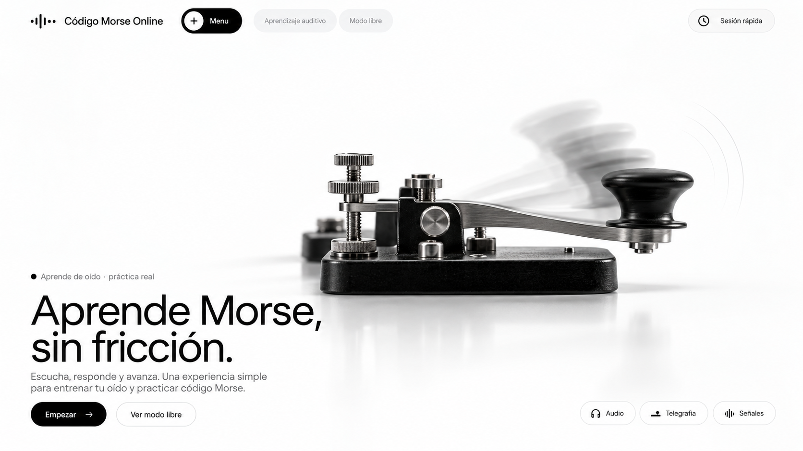

# Código Morse Online

Aprende Morse de oído en el navegador. Escuchas una señal, eliges la letra y avanzas.

**[codigo-morse-online.netlify.app](https://codigo-morse-online.netlify.app/)**



---

## El problema

Casi todas las webs de Morse te reciben con una tabla de 40 símbolos y un panel de
ajustes. Antes de oír tu primera letra tienes que decidir velocidad, tono, espaciado
y modo de práctica — sin tener aún ni idea de qué significa ninguna de esas cosas.

Este proyecto empezó igual: ocho secciones compitiendo por la atención. La versión
actual tiene **dos caminos visibles** y ninguna decisión previa.

| | |
|---|---|
| **Aprender** | Pulsas *Empezar* y ya estás en una sesión. Diez preguntas, feedback inmediato, resumen. Cero configuración. |
| **Modo libre** | Una mesa de telegrafía: la llave, un traductor y el abecedario. |

Los ajustes existen, pero detrás de un panel. Un principiante no debería tener que
saber qué es el espaciado Farnsworth para empezar.

---

## Lo interesante por dentro

### El audio manda sobre lo visual

El Morse no es decorativo: si el timing falla, el producto no sirve. Todo se apoya
en el estándar **PARIS** —una unidad = 1200/PPM ms— y en el **espaciado Farnsworth**.

La palabra PARIS son 50 unidades exactas, y se reparten así:

```
31 unidades  contenido de carácter (elementos + huecos dentro de la letra)
19 unidades  espaciado (4 huecos de letra de 3 + 1 hueco de palabra de 7)
```

Farnsworth emite los caracteres rápido (≥ 18 PPM) y **estira sólo esas 19 unidades**
hasta que la palabra estándar completa dura `60/velocidad` segundos. Con velocidad de
carácter `C` y velocidad efectiva `S`:

```
tiempo de espaciado por palabra:  ta = 60/S − 37.2/C
factor sobre la unidad de carácter:  F = (50·C/S − 31) / 19
```

Con `C = S` da exactamente 1, así que la misma expresión sirve con Farnsworth
apagado. Es el estándar de la ARRL, y aquí importa porque la versión anterior usaba
`F = C/S`: los huecos salían a 3 y 7 unidades de la velocidad efectiva en vez de
repartir el tiempo sobrante, y **pedir 5 PPM producía 9,05 PPM reales**. Hay un test
que mide PARIS repetido y comprueba que la velocidad efectiva es la pedida, y otro
que rechaza expresamente los valores del motor roto.

Una locución completa se agenda sobre **un único oscilador**: la envolvente entera se
escribe de golpe sobre su nodo de ganancia. Una frase de 80 elementos son ~320 puntos
de automatización en un nodo, en vez de 160 nodos con su coste de recolección de
basura. El hilo de audio recibe las instrucciones una sola vez y no se le vuelve a
molestar. El coste de agendado es lineal y medible, así que el traductor tiene un
tope de 500 caracteres: a 6.000 el hilo principal se bloqueaba 2,1 s.

### La sincronía imagen–sonido no puede derivar

Cuando suena un punto, el símbolo correspondiente se ilumina en ámbar exactamente
durante ese punto. No hay ningún temporizador visual: un solo `requestAnimationFrame`
consulta el reloj del `AudioContext` y pregunta *"¿qué elemento suena ahora?"*. Como
no acumula, no deriva nunca, y si la pestaña estuvo oculta diez segundos el siguiente
muestreo describe el instante correcto.

Un detalle que se suele pasar por alto: se usa `currentTime - outputLatency`, no
`currentTime`. Lo que se *oye* en un instante se renderizó unos milisegundos antes, y
sin compensarlo la imagen va sistemáticamente por delante del sonido — hasta 60 ms
con auriculares Bluetooth.

Ese mismo reloj clasifica punto y raya en la llave manual. Antes el umbral audible
usaba el reloj de audio y el medidor visual usaba `performance.now()`: dos relojes
para el mismo evento, que se separaban bajo carga.

### El bucle de animación duerme

Un solo `requestAnimationFrame` para toda la aplicación, con recuento de referencias
y auto-apagado: tras medio segundo sin nada que sonar se detiene solo. **En reposo la
página consume cero frames.** `frameLoop.subscriberCount()` e `isRunning()` existen
para poder comprobarlo: navegando dieciséis veces entre las cuatro rutas el número de
suscriptores no se mueve de 3 y el bucle vuelve a dormirse.

### Frontera estricta

`src/core/` no toca el DOM. `src/ui/` no calcula timing Morse. Es verificable de un
vistazo:

```bash
grep -rE "document\.|window\.|requestAnimationFrame" src/core/ src/data/   # sin resultados
```

---

## Stack

HTML, CSS y JavaScript. **Sin framework, sin bundler y sin una sola dependencia de
ejecución.** Módulos ES nativos, cargados bajo demanda por ruta.

- **Web Audio API** — generación de tonos y agendado
- **Pointer Events** — la llave, con ratón, táctil y teclado
- **localStorage** — progreso y ajustes, en tu dispositivo
- **IntersectionObserver** — apariciones al entrar en pantalla
- **CSS** — todo el movimiento: `animation`, `transition` y una custom property que
  escribe el scroll. No se usa la Web Animations API en ninguna parte.

No usa framework porque no lo necesita: son cuatro pantallas y un motor de audio.
Añadir uno lo habría hecho más pesado, más lento de cargar y más difícil de leer,
sin resolver ningún problema que tuviera.

## Arquitectura

```
index.html          shell, navegación, sin lógica
styles.css          tokens y sistema visual
src/
  data/             morse · levels · tips          tablas, sin comportamiento
  core/             timing · audio · player        ← CERO DOM
                    keyer · signal · pulse · store · adaptive
  ui/               router · frame-loop · scope    infraestructura
                    reveal · motion · signal-line · keys
                    morse-glyph · waveform · sheet · toast
  views/            home · aprender · libre · acerca
  app.js            cableado
tests/              timing · morse · progression · store · audio
  helpers/          fake-audio                     AudioContext con reloj manual
```

`core/signal.js` es la **única** frontera entre el núcleo y la interfaz. Mezcla las
dos fuentes de señal —la llave en vivo, impredecible, y la reproducción agendada,
determinista— y publica un solo objeto de estado. `ui/frame-loop.js` lo muestrea una
vez por frame y lo reparte; los componentes leen los mismos campos y no ramifican
según de dónde venga el sonido.

Cada vista se monta con un *scope* que registra listeners, temporizadores y
suscripciones; el router lo destruye antes de montar la siguiente.

Esa frontera es también lo que hace que las pruebas no necesiten navegador. `core/`
no conoce el DOM, así que el timing se comprueba con aritmética pura; y el único
módulo que habla con Web Audio recibe el contexto por `globalThis`, así que basta un
`AudioContext` falso de 84 líneas —con reloj que avanza a mano— para probar la
envolvente agendada, el `stop` y el umbral punto/raya de la llave sin abrir nada.

## Decisiones de UX

- **Cero configuración antes de empezar.** Valores por defecto razonables; los ajustes
  viven en un panel para quien los busque.
- **Primero el oído, después la ayuda.** La primera sesión presenta E y T —las oyes y
  se te dice cuál es cada una— antes de preguntar nada; dura dos sonidos y no vuelve a
  salir. Las mnemotecnias no están en pantalla de entrada: aparecen cuando fallas esa
  letra. El orden es sonido → intento → ayuda si hace falta.
- **La práctica adaptativa es invisible.** El sistema insiste en las letras que fallas
  sin que tengas que activar nada. Es muestreo ponderado por precisión, **no
  repetición espaciada**: no hay marcas de tiempo, ni intervalos, ni fechas de próxima
  revisión. Por eso el módulo se llama `adaptive.js` y no `srs.js`.
- **La meta de nivel la calcula la misma expresión que la evalúa.** Subes con un 85 %
  de acierto sobre tus últimas 10–12 respuestas; el texto que lo anuncia sale de
  `targetFor(size)`, y un test comprueba que lógica y texto coinciden en las 91
  combinaciones posibles.
- **Un solo color.** La interfaz es blanca y negra; el ámbar significa *hay señal
  ahora mismo*. Si algo está ámbar, está sonando — también el contacto dibujado en
  *Acerca de*, que en reposo es gris como el resto del mecanismo.
- **Sin gamificación pesada.** Se retiraron XP, rangos y logros. El progreso real es
  la recompensa.
- **El movimiento reducido respeta la información.** Con `prefers-reduced-motion` se
  apagan las entradas y los adornos, pero el símbolo iluminado se queda: dice qué
  está sonando, no es decoración.
- **Se animan eventos, no pantallas.** Nada flota por decorar: la interfaz se mueve
  cuando empieza una señal, cuando se cierra el contacto, cuando llega una respuesta.

## Español

La tabla es ITU-R M.1677-1, que no tiene tildes ni Ñ. En vez de borrar esas letras
—«CÓMO ESTÁS» se transmitía como «CMO ESTS» y «AÑO» como «AO»— el texto se normaliza:
se descomponen los caracteres y se quitan los diacríticos, así que **Á→A, Ü→U, Ç→C y
Ñ→N**.

La extensión nacional `--.--` para la Ñ existe, pero no está en la tabla que declara
este proyecto y de la que salen el abecedario, los niveles y el decodificador de la
llave. Añadirla obligaría a que la llave decodificase ese código como Ñ y a meter una
celda no-ITU en el abecedario. Un operador que reciba «ANO» lo copia; una letra
borrada no la copia nadie.

## Accesibilidad

- Navegación completa por teclado. Los atajos **nunca secuestran la tecla nativa**:
  con el foco en un botón, la barra espaciadora lo activa. Antes no: un atajo global
  se comía el `Space` y con el foco puesto automáticamente en la primera opción era
  imposible responder con el teclado.
- El menú y el panel de ajustes cerrados son `inert` (con `visibility: hidden` de
  respaldo). Con sólo `opacity: 0` seguían siendo tabulables, y la trampa de foco del
  menú se activaba estando cerrado: el tabulador quedaba atrapado dando vueltas en
  cuatro enlaces invisibles, sin poder llegar nunca al contenido.
- El panel de ajustes es un diálogo real: `role="dialog"`, `aria-modal`, título
  asociado, foco inicial dentro, tabulador atrapado, `Escape` cierra y el foco vuelve
  a un control **visible**. Mientras está abierto el resto de la página es `inert` —
  salvo el toast, para que «Progreso borrado» se anuncie.
- Objetivos táctiles de **44 px como mínimo en todos los controles**, medido en las
  cuatro vistas y en el panel de ajustes a 375–1920 px. Donde el diseño pide un
  elemento más pequeño (los enlaces del pie, el logotipo, el interruptor) el área
  pulsable se amplía sin tocar lo que se ve.
- Contraste AA verificado: 4,81:1 en el texto tenue (`#6f6f6f` sobre `#fafafa`), y
  los pasos inactivos del bloque cinemático subidos de `opacity: .3` a `.58` — a .3
  quedaban en 2,7:1 sobre la foto.
- Zoom no bloqueado, selección de texto libre, `:focus-visible` en todo, y
  `prefers-reduced-motion` respetado.

## Ejecutar en local

No hay nada que instalar, pero los módulos ES necesitan servirse por HTTP:

```bash
python3 -m http.server 8000
# http://localhost:8000
```

Pruebas — 70, sin instalar nada:

```bash
node --test "tests/**/*.test.js"
```

Cubren el timing Farnsworth contra la definición de PARIS, la normalización del
español, la promoción de nivel en las 91 ventanas posibles, la migración v1→v2 con un
volcado real del esquema antiguo, y el motor de audio y la llave contra un
`AudioContext` falso —incluido el umbral punto/raya justo por encima y por debajo del
límite.

## Desplegar

Estático puro: no hay nada que construir. Se despliega subiendo el directorio del
proyecto a Netlify —publish directory `.`, sin comando de build— y las rutas van en
el hash, así que no hace falta ninguna regla de reescritura.

**Consecuencia importante de desplegar por carpeta: `.gitignore` no filtra nada.**
Todo archivo que esté en el directorio queda accesible públicamente. Por eso las
fotografías originales sin comprimir (~8 MB) viven *fuera* del proyecto y no en
`reference/`; ahí sólo queda `tech-forward-morse.png`, que es la captura de este
README y ninguna página del sitio carga. Netlify sí omite lo que empieza por punto
(`.git/`, `.gitignore`). Antes de subir conviene mirar qué hay dentro:

```bash
du -sh --exclude=.git *
```

## Compatibilidad

**Chrome/Edge 108+, Firefox 112+, Safari 16+.** Cada mínimo tiene un motivo concreto:

| API | Mínimo que impone |
|---|---|
| `overflow: clip` | Safari 16 |
| `svh` / `dvh` | Chrome 108 · Firefox 101 · Safari 15.4 |
| `element.inert` | Chrome 102 · Firefox 112 · Safari 15.5 |
| `Object.hasOwn` | Chrome 93 · Firefox 92 · Safari 15.4 |

Por debajo de esos números el sitio carga, pero degrada de formas visibles: sin
`overflow: clip` la llave del hero desborda en horizontal, y sin `Object.hasOwn` no
suena nada. No se anuncia soporte que no se haya comprobado.

En iOS el audio sólo arranca tras un gesto del usuario, y el contexto se reanuda en
cada interacción porque el sistema lo suspende al volver de segundo plano. Safari no
expone `outputLatency`, así que se cae a `baseLatency`.

---

La historia de por qué existe está en la propia app, en
[Acerca de](https://codigo-morse-online.netlify.app/#/acerca).
